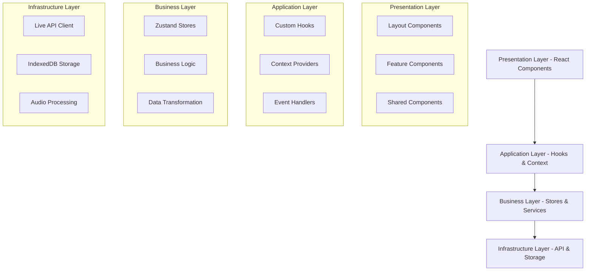
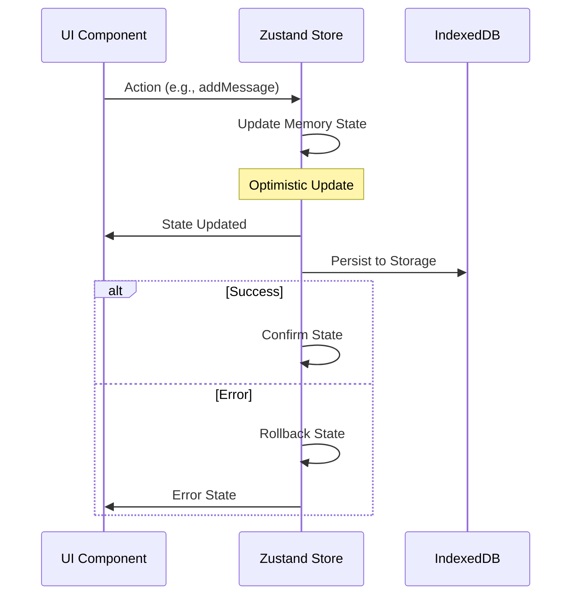
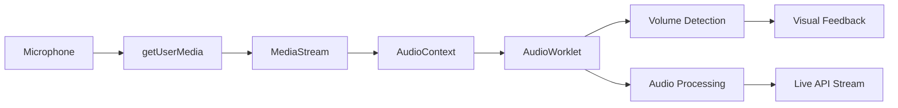

# Google Gemini Live API 對話測試平台 - 技術文檔

## 📋 專案概述

**最後更新**: 2025-08-20  
**專案版本**: 0.2.0  
**技術負責人**: Development Team

這是一個基於 React 18 + TypeScript 的專業多模態 AI 對話平台，整合了完整的 Google Gemini API 生態系統。**支援雙模式對話系統**：Live API 即時互動和 STT+TTS 分離式處理，提供企業級的語音對話、多聊天室管理、session resumption、高品質音頻處理等功能。

### 🎯 專案目標

1. **雙模式 API 整合**：Live API (即時) + STT+TTS (高品質) 的完整解決方案
2. **企業級對話管理系統**：多聊天室、智能模式切換、數據持久化、session resumption
3. **專業音頻處理 Pipeline**：16kHz 採樣、分段處理、多格式支援、自動清理
4. **開發者友好工具生態**：9個核心 hooks、統一服務層、完整的 TypeScript 支援

---

## 🏗️ 系統架構

### 架構設計理念

專案採用 **分層架構 + 組件化設計**，確保可維護性、可測試性和可擴展性：



### 核心架構元件

#### 1. Presentation Layer (展示層)
- **TwoColumnLayout**: 主要佈局組件，實現響應式雙欄設計
- **Feature Components**: 聊天室、對話區、輸入控制、音頻視覺化等功能組件
- **Shared Components**: 錯誤邊界、摺疊面板等可重用組件
- **Debug Components**: 開發調試工具組件（ToggleTest 等）

#### 2. Application Layer (應用層)
- **LiveAPIContext**: Live API 狀態管理和連接控制
- **Custom Hooks**: 封裝業務邏輯和狀態管理邏輯
- **Event System**: 統一的事件處理和傳播機制

#### 3. Business Layer (業務層)
- **Persistent Chat Store**: 基於 Zustand 的狀態管理和數據持久化
- **Session Management**: 對話 session 的創建、恢復、管理
- **Data Models**: 統一的數據模型和類型定義

#### 4. Infrastructure Layer (基礎設施層)
- **Gemini Services**: 完整的 Gemini API 服務封裝 (Live API, STT, TTS, Chat)
- **IndexedDB Storage**: 本地數據存儲和查詢
- **Audio Processing Pipeline**: MediaRecorder + Web Audio API 的專業音頻處理

---

## 📁 當前組件結構

### 主要組件目錄

#### 佈局組件 (`src/components/layout/`)
- **TwoColumnLayout.tsx**: 雙欄佈局組件，提供左側聊天室和主要內容區
- **Header.tsx**: 應用程式頂部標題列
- **layout.scss**: 佈局樣式定義

#### 聊天功能 (`src/components/chat-*/`)
- **chat-room-sidebar/**: 聊天室側邊欄管理
- **conversation-display/**: 對話顯示區域
- **chat-input/**: 聊天輸入控制區
  - **ConversationModeSelector.tsx**: 雙模式切換下拉選單 🆕
  - **TTSControlTray.tsx**: TTS 控制面板 🆕

#### 音頻處理 (`src/components/audio-*/`)
- **audio-visualizer/**: AI 音頻視覺化
- **audio-pulse/**: 音頻脈衝效果
- **wave-animation/**: 波形動畫效果

#### 控制台和除錯 (`src/components/`)
- **console-sidebar/**: 開發者控制台側邊欄
- **debug/**: 除錯工具組件 (ToggleTest)

#### 共用組件 (`src/components/shared/`)
- **ErrorBoundary.tsx**: 錯誤邊界處理
- **CollapsiblePanel.tsx**: 可摺疊面板組件

### 核心檔案狀態

#### ✅ 活躍使用的檔案
- `TwoColumnLayout`: 主要佈局系統
- `debug/ToggleTest`: 開發除錯工具
- `utils/message-factory.ts`: 統一的訊息創建工廠函數
- `utils/session-debug.ts`: 簡化的 session 除錯工具

#### 🎯 核心 Hooks (9個)
- `use-chat-manager.ts`: 聊天室管理核心
- `use-transcription.ts`: 整合轉錄功能（包含 Live API 整合）
- `use-conversation.ts`: 對話發送功能
- `use-conversation-events.ts`: Live API 事件處理
- `use-live-api.ts`: Live API 連接管理
- `use-session-resumption.ts`: Session 恢復功能
- `use-webcam.ts`: 網路攝影機控制
- `use-screen-capture.ts`: 螢幕分享功能
- `use-media-stream-mux.ts`: 媒體流類型定義

---

## 🔧 核心組件和模組

### 1. 雙模式 API 整合系統 🆕

#### 🎯 模式架構概覽

專案現在支援兩種完全不同的對話模式，滿足不同場景需求：

| 模式 | API 服務 | 延遲 | 品質 | 適用場景 |
|------|----------|------|------|----------|
| **Live API** | Gemini Live API | <100ms | 即時串流 | 日常對話、快速互動 |
| **STT+TTS** | 3個獨立 API | ~3秒 | 專業級 | 會議記錄、專業訪談 |

#### 🚀 STT+TTS 模式 (新增) 

完全重新設計的分離式語音處理系統：

```typescript
// src/services/gemini/
├── gemini-stt.ts    // 分段錄音 + Gemini Audio API
├── gemini-tts.ts    // 30種語音 + gemini-2.5-flash-preview-tts
├── gemini-chat.ts   // 標準對話 + gemini-2.5-flash
└── genai-live-client.ts // Live API WebSocket (原有)
```

**STT 服務特色**:
- ✅ **分段處理**: 每3秒自動分割和處理音頻
- ✅ **高品質採樣**: 16kHz 專業級錄音
- ✅ **多格式支援**: WAV, MP3, FLAC, AAC, OGG, AIFF
- ✅ **自動清理**: 用完即丟的音頻管理

**TTS 服務特色**:
- ✅ **30種專業語音**: Kore, Zephyr, Puck, Charon 等
- ✅ **自定義風格**: 支援語音風格提示
- ✅ **多語言智能**: 自動語言檢測和適配
- ✅ **高品質合成**: 24kHz PCM 音頻輸出

#### 🔄 智能模式切換

**ConversationModeSelector** 組件提供無縫切換：

```typescript
export type ConversationMode = 'live-api' | 'stt-tts';

interface ConversationModeSelectorProps {
  currentMode: ConversationMode;
  onModeChange: (mode: ConversationMode) => void;
  disabled?: boolean; // 活躍連接時自動禁用
}
```

### 2. LiveAPI 整合系統 (既有)

#### LiveAPIContext (`src/contexts/LiveAPIContext.tsx`)
```typescript
interface LiveAPIContextValue extends UseLiveAPIResults {
  error: string | null;
  clearError: () => void;
  resetAIResponseState?: () => void;
}
```

**設計特點**:
- 統一的 API 狀態管理
- 錯誤邊界處理
- 自動重連機制
- 多層級錯誤恢復

#### useLiveAPI Hook (`src/hooks/use-live-api.ts`)
負責管理與 Gemini Live API 的連接和通信：

**核心功能**:
- WebSocket 連接管理
- 音頻/視頻流處理
- 消息序列化和反序列化
- 連接狀態追蹤

### 2. 狀態管理系統

#### Persistent Chat Store (`src/stores/chat-store-persistent.ts`)

採用 **Zustand + subscribeWithSelector** 中間件，實現高效的狀態管理：

```typescript
interface ChatState {
  // Core State
  chatRooms: ChatRoom[];
  activeChatRoom: string | null;
  currentTranscript: string;
  isRecording: boolean;
  
  // Sync State
  isLoading: boolean;
  isInitialized: boolean;
  lastSyncedAt: Date | null;
  syncError: string | null;
  
  // Actions
  initialize: () => Promise<void>;
  addChatRoom: (chatRoom: ChatRoom) => Promise<void>;
  setActiveChatRoom: (chatRoomId: string) => Promise<void>;
  addMessage: (chatRoomId: string, message: Message) => Promise<void>;
  // ... 更多操作方法
}
```

**特色功能**:
- **Optimistic Updates**: 先更新本地狀態，再同步到儲存
- **Error Recovery**: 操作失敗時自動回滾狀態
- **Debounced Persistence**: 防抖式數據持久化
- **Selective Subscriptions**: 精確的狀態訂閱，減少不必要的重渲染

#### 狀態更新流程



### 3. 數據持久化機制

#### IndexedDB 封裝 (`src/lib/indexeddb/`)

**架構設計**:
- **Database Layer**: 數據庫連接和版本管理
- **Storage API**: 統一的數據操作接口  
- **Migration System**: 自動數據遷移和升級
- **Type Safety**: 完整的 TypeScript 類型支援

```typescript
// Storage API 示例
interface StorageAPI {
  // Chat Rooms
  saveChatRoom(chatRoom: ChatRoom): Promise<void>;
  getChatRoom(id: string): Promise<ChatRoom | null>;
  getAllChatRooms(): Promise<ChatRoom[]>;
  deleteChatRoom(id: string): Promise<void>;
  
  // Messages
  addMessage(chatRoomId: string, message: Message): Promise<void>;
  getMessages(chatRoomId: string, limit?: number): Promise<Message[]>;
  updateMessage(chatRoomId: string, message: Message): Promise<void>;
  
  // Settings
  setSetting<T>(key: string, value: T): Promise<void>;
  getSetting<T>(key: string, defaultValue: T): Promise<T>;
}
```

**數據遷移系統**:
```typescript
interface Migration {
  version: number;
  description: string;
  up: (db: IDBDatabase, transaction: IDBTransaction) => Promise<void>;
  down?: (db: IDBDatabase, transaction: IDBTransaction) => Promise<void>;
}
```

### 4. Session 管理和恢復

#### Session Resumption (`src/hooks/use-session-resumption.ts`)

**核心概念**:
- **Session State**: 對話的完整狀態快照
- **Resumption Points**: 可恢復的檢查點
- **Context Preservation**: 上下文信息的保存和恢復

```typescript
interface SessionState {
  id: string;
  chatRoomId: string;
  messages: Message[];
  context: ConversationContext;
  timestamp: Date;
  metadata: SessionMetadata;
}

interface ConversationContext {
  systemPrompt?: string;
  modelConfig: ModelConfiguration;
  mediaState: MediaState;
  transcriptionState: TranscriptionState;
}
```

**恢復流程**:
1. **檢測中斷**: 監控連接狀態和異常
2. **狀態保存**: 自動保存當前對話狀態
3. **重新建立**: 重建 Live API 連接
4. **上下文恢復**: 恢復對話上下文和狀態
5. **無縫續接**: 用戶無感知的對話繼續

---

## 🎵 音頻處理 Pipeline

### Web Audio API 整合

#### AudioWorklet 系統 (`src/lib/worklets/`)

**vol-meter.ts**: 音量檢測 Worklet
```typescript
class VolMeterProcessor extends AudioWorkletProcessor {
  process(inputs: Float32Array[][], outputs: Float32Array[][]) {
    const input = inputs[0];
    if (input && input[0]) {
      const volume = this.calculateRMS(input[0]);
      this.port.postMessage({ volume, timestamp: currentTime });
    }
    return true;
  }
  
  calculateRMS(samples: Float32Array): number {
    const sum = samples.reduce((acc, sample) => acc + sample * sample, 0);
    return Math.sqrt(sum / samples.length);
  }
}
```

**audio-processing.ts**: 音頻預處理 Worklet
```typescript
class AudioProcessingWorklet extends AudioWorkletProcessor {
  process(inputs: Float32Array[][], outputs: Float32Array[][]) {
    const input = inputs[0][0];
    const output = outputs[0][0];
    
    if (input && output) {
      // 音頻預處理: 降噪、正規化、增益控制
      for (let i = 0; i < input.length; i++) {
        output[i] = this.applyProcessing(input[i]);
      }
    }
    return true;
  }
}
```

#### 音頻處理流程



### 音頻視覺化系統

#### AIAudioVisualizer (`src/components/audio-visualizer/AIAudioVisualizer.tsx`)

**特色功能**:
- **實時頻譜分析**: 使用 AnalyserNode 進行頻域分析
- **多種視覺效果**: 波形、頻譜、脈衝等視覺化模式
- **平滑動畫**: 基於 RequestAnimationFrame 的流暢動畫
- **響應式設計**: 自適應不同螢幕尺寸的視覺效果

```typescript
interface AudioVisualizerProps {
  audioContext?: AudioContext;
  mediaStream?: MediaStream;
  analyserNode?: AnalyserNode;
  visualType: 'waveform' | 'spectrum' | 'pulse' | 'circular';
  sensitivity: number;
  smoothingTimeConstant: number;
}
```

---

## 🧠 Hook 系統設計

### 自定義 Hook 架構 (9個核心 Hooks)

#### 🆕 use-conversation-mode.ts
雙模式切換的核心邏輯：

```typescript
interface UseConversationModeResult {
  currentMode: ConversationMode; // 'live-api' | 'stt-tts'
  switchMode: (mode: ConversationMode) => void;
  isLiveMode: boolean;
  isSTTTTSMode: boolean;
  canSwitchMode: boolean; // 活躍連接時禁用
  setCanSwitchMode: (canSwitch: boolean) => void;
}
```

#### 🆕 use-gemini-conversation.ts
STT+TTS 完整流程管理：

```typescript
interface UseGeminiConversationResult {
  // STT State
  isListening: boolean;
  currentTranscript: string;
  isTranscriptFinal: boolean;
  
  // TTS State  
  isSpeaking: boolean;
  
  // Chat State
  isProcessingChat: boolean;
  
  // Actions
  startListening: () => Promise<void>; // 自動分段錄音
  stopListening: () => void;
  sendTextMessage: (message: string) => Promise<void>; // Chat + 自動 TTS
  speakMessage: (message: string) => Promise<void>;
  
  // Configuration
  updateConfig: (config: Partial<UseGeminiConversationConfig>) => void;
}
```

**特色功能**:
- ✅ **三服務整合**: STT + Chat + TTS 的完整流程
- ✅ **分段音頻處理**: 3秒自動分割和轉錄
- ✅ **自動語音回覆**: 文字和語音輸入都會觸發 TTS
- ✅ **錯誤恢復**: 單一服務失敗不影響其他功能

#### use-chat-manager.ts (既有)
聊天管理的核心邏輯：

```typescript
interface ChatManager {
  // State
  chatRooms: ChatRoom[];
  activeChatRoom: string | null;
  isLoading: boolean;
  error: string | null;
  
  // Actions
  createNewChatRoom: (name?: string) => Promise<ChatRoom>;
  switchChatRoom: (id: string) => Promise<void>;
  deleteChatRoom: (id: string) => Promise<void>;
  renameChatRoom: (id: string, newName: string) => Promise<void>;
  clearError: () => void;
}
```

#### use-transcription.ts
整合轉錄邏輯（重構後統一）：

```typescript
interface UseTranscriptionOptions {
  // 是否啟用 Live API 事件整合
  enableLiveAPIIntegration?: boolean;
}

interface UseTranscriptionResult {
  // State
  inputTranscription: TranscriptionState;
  outputTranscription: TranscriptionState;
  isRecording: boolean;
  
  // Actions
  startInputTranscription: () => void;
  stopInputTranscription: () => void;
  clearTranscriptions: () => void;
  
  // Live API specific handlers
  setInputTranscriptionDirect: (text: string, isFinal: boolean) => void;
  setOutputTranscriptionDirect: (text: string, isFinal: boolean) => void;
}

// 便利函數，啟用 Live API 整合
export function useTranscriptionIntegration() {
  return useTranscription({ enableLiveAPIIntegration: true });
}
```

#### use-session-resumption.ts
Session 恢復邏輯（符合官方標準）：

```typescript
interface UseSessionResumptionReturn {
  // 官方標準 API
  storeSessionHandle: (chatRoomId: string, handle: string) => Promise<void>;
  getSessionHandle: (chatRoomId: string) => string | null;
  clearSessionHandle: (chatRoomId: string) => Promise<void>;
  hasValidSession: (chatRoomId: string) => boolean;
  cleanupExpiredSessions: (chatRoomId?: string) => Promise<void>;
  
  // 向後相容 API
  handleSessionResumptionUpdate: (chatRoomId: string, update: SessionResumptionUpdate) => Promise<void>;
  
  // 統計資訊
  getSessionStats: () => { totalSessions: number; roomsWithSessions: string[] };
}
```

### 🛠️ 工具系統

#### message-factory.ts
統一的訊息創建工廠函數：

```typescript
// 通用訊息創建函數
export const createMessage = (
  type: 'user' | 'assistant',
  content: string,
  options: Partial<Message> = {}
): Message => { /* ... */ };

// 便利函數
export const createUserMessage = (content: string, options?: Partial<Message>): Message;
export const createAssistantMessage = (content: string, options?: Partial<Message>): Message;
export const createErrorMessage = (error: unknown): Message;
```

**設計目的**: 
- 消除多個 hooks 中重複的訊息創建邏輯
- 統一訊息 ID 生成策略
- 提供類型安全的訊息創建接口

#### session-debug.ts
簡化的 session 除錯工具：

```typescript
class SimpleSessionDebugLogger {
  setEnabled(enabled: boolean): void;
  log(event: string, data?: any): void;
  getLogs(): SessionDebugInfo[];
  clearLogs(): void;
  getReport(): string;
}

// 全域存取（開發環境）
window.sessionDebug = {
  enable: () => sessionDebugLogger.setEnabled(true),
  disable: () => sessionDebugLogger.setEnabled(false),
  getLogs: () => sessionDebugLogger.getLogs(),
  getReport: () => console.log(sessionDebugLogger.getReport()),
  clear: () => sessionDebugLogger.clearLogs()
};
```

### Hook 組合模式

使用 **Higher-Order Hook** 模式組合複雜邏輯：

```typescript
// Compound hook example
function useConversationManager() {
  const chatManager = useChatManager();
  const transcription = useTranscriptionIntegration();
  const sessionResumption = useSessionResumption();
  const liveAPI = useLiveAPIContext();
  
  // 組合邏輯
  const startNewConversation = useCallback(async () => {
    const chatRoom = await chatManager.createNewChatRoom();
    await transcription.startTranscription();
    await sessionResumption.saveSession(createSnapshot(chatRoom));
    return chatRoom;
  }, [chatManager, transcription, sessionResumption]);
  
  return {
    ...chatManager,
    ...transcription,
    ...sessionResumption,
    startNewConversation,
  };
}
```

---

## 🎨 UI/UX 設計系統

### 佈局系統

#### 佈局系統 (`src/components/layout/`)

**ThreeColumnLayout**: 主要的三欄響應式佈局
**TwoColumnLayout**: 簡化的雙欄佈局選項

**設計原則**:
- **Mobile First**: 響應式設計，優先支援行動裝置
- **Progressive Enhancement**: 桌面版提供更豐富的功能
- **Accessibility**: 完整的鍵盤導航和螢幕閱讀器支援
- **Flexible Layout**: 支援不同的佈局配置需求

```typescript
interface LayoutBreakpoints {
  mobile: 768;     // < 768px: 單欄模式
  tablet: 1024;    // 768px-1024px: 左側收合
  desktop: 1024;   // > 1024px: 完整三欄
}

interface LayoutState {
  leftPanelVisible: boolean;
  rightPanelVisible: boolean;
  leftPanelWidth: number;
  rightPanelWidth: number;
  currentBreakpoint: keyof LayoutBreakpoints;
}
```

### 組件設計原則

#### 1. 組件組合 (Composition)
```typescript
// Bad: 巨型組件
function ConversationArea() {
  return (
    <div>
      <MessageList />
      <TranscriptionDisplay />
      <AudioVisualizer />
      <TypingIndicator />
    </div>
  );
}

// Good: 組合式設計
function ConversationArea({ children }) {
  return (
    <div className="conversation-area">
      {children}
    </div>
  );
}

// Usage
<ConversationArea>
  <MessageList messages={messages} />
  <TranscriptionDisplay transcript={transcript} />
  <AudioVisualizer stream={audioStream} />
  <TypingIndicator isVisible={isTyping} />
</ConversationArea>
```

#### 2. Props 介面設計
```typescript
// 明確的 Props 介面
interface MessageBubbleProps {
  message: Message;
  variant: 'user' | 'assistant' | 'system';
  timestamp?: Date;
  isLoading?: boolean;
  onRetry?: () => void;
  children?: React.ReactNode;
}

// 使用 discriminated unions 處理不同類型
type MessageProps = 
  | { type: 'text'; content: string }
  | { type: 'audio'; audioUrl: string; duration: number }
  | { type: 'image'; imageUrl: string; alt: string }
  | { type: 'file'; fileName: string; fileSize: number };
```

### SCSS 架構

#### 變數系統 (`src/styles/variables.scss`)
```scss
// Color Palette
:root {
  // Primary Colors
  --bg-primary: #{$dark-background};
  --bg-secondary: #{$darker-background};
  --bg-tertiary: #{$darkest-background};
  
  // Text Colors
  --text-primary: #{$light-text};
  --text-secondary: #{$medium-text};
  --text-muted: #{$muted-text};
  
  // Interactive Colors
  --accent-color: #{$blue-accent};
  --hover-color: #{$blue-hover};
  --active-color: #{$blue-active};
  
  // State Colors
  --error-color: #{$red-error};
  --warning-color: #{$yellow-warning};
  --success-color: #{$green-success};
  --info-color: #{$blue-info};
  
  // Layout
  --border-radius: 8px;
  --shadow-light: 0 2px 4px rgba(0, 0, 0, 0.1);
  --shadow-medium: 0 4px 8px rgba(0, 0, 0, 0.15);
  --shadow-heavy: 0 8px 16px rgba(0, 0, 0, 0.2);
  
  // Typography
  --font-family-base: 'Segoe UI', 'SF Pro Display', system-ui, sans-serif;
  --font-family-mono: 'SF Mono', 'Consolas', monospace;
  
  // Z-Index Scale
  --z-dropdown: 1000;
  --z-modal: 2000;
  --z-tooltip: 3000;
  --z-notification: 4000;
}
```

---

## 🧪 測試策略

### 測試架構

#### 1. 單元測試 (Unit Tests)
- **Components**: React Testing Library + Jest
- **Hooks**: @testing-library/react-hooks
- **Utilities**: Pure function testing
- **Stores**: Zustand store testing

#### 2. 整合測試 (Integration Tests)
- **API Integration**: Mock Service Worker (MSW)
- **Database Operations**: fake-indexeddb
- **Audio Processing**: web-audio-test-api

#### 3. E2E 測試準備
- **Test Framework**: Jest + jsdom
- **Mock Strategy**: 完整的 API 和瀏覽器 API mock

### 測試實例

#### Hook 測試示例
```typescript
// src/hooks/__tests__/use-chat-manager.test.ts
describe('useChatManager', () => {
  it('should create new chat room', async () => {
    const { result } = renderHook(() => useChatManager());
    
    await act(async () => {
      const chatRoom = await result.current.createNewChatRoom('Test Chat');
      expect(chatRoom).toBeDefined();
      expect(chatRoom.name).toBe('Test Chat');
    });
    
    expect(result.current.chatRooms).toHaveLength(1);
  });
  
  it('should handle errors gracefully', async () => {
    // Mock storage failure
    jest.spyOn(chatRoomStorage, 'saveChatRoom').mockRejectedValue(new Error('Storage error'));
    
    const { result } = renderHook(() => useChatManager());
    
    await act(async () => {
      try {
        await result.current.createNewChatRoom('Failed Chat');
      } catch (error) {
        expect(error.message).toBe('Storage error');
      }
    });
    
    expect(result.current.error).toBe('Storage error');
  });
});
```

#### 整合測試示例
```typescript
// src/__tests__/integration/chat-room-management.integration.test.tsx
describe('Chat Room Management Integration', () => {
  it('should manage complete chat room lifecycle', async () => {
    render(<App />);
    
    // Create new chat room
    const newChatButton = screen.getByText('新對話');
    fireEvent.click(newChatButton);
    
    // Verify chat room appears
    await waitFor(() => {
      expect(screen.getByText(/新對話/)).toBeInTheDocument();
    });
    
    // Send message
    const input = screen.getByPlaceholderText('輸入訊息...');
    fireEvent.change(input, { target: { value: 'Hello, AI!' } });
    fireEvent.keyDown(input, { key: 'Enter', code: 'Enter' });
    
    // Verify message appears
    await waitFor(() => {
      expect(screen.getByText('Hello, AI!')).toBeInTheDocument();
    });
  });
});
```

### Mock 策略

#### Live API Mock
```typescript
// src/__mocks__/google-genai-live-client.ts
export class MockLiveAPIClient {
  private connectionState: 'disconnected' | 'connecting' | 'connected' = 'disconnected';
  private eventHandlers: Map<string, Function[]> = new Map();
  
  connect(): Promise<void> {
    this.connectionState = 'connecting';
    return new Promise((resolve) => {
      setTimeout(() => {
        this.connectionState = 'connected';
        this.emit('connected');
        resolve();
      }, 100);
    });
  }
  
  sendMessage(message: any): void {
    // Simulate AI response
    setTimeout(() => {
      this.emit('message', {
        id: generateId(),
        role: 'assistant',
        content: 'Mock AI response to: ' + message.content,
        timestamp: new Date()
      });
    }, 500);
  }
  
  private emit(event: string, data?: any) {
    const handlers = this.eventHandlers.get(event) || [];
    handlers.forEach(handler => handler(data));
  }
}
```

---

## 📊 效能優化策略

### React 效能優化

#### 1. Memoization 策略
```typescript
// Component Memoization
const MemoizedChatSidebar = memo(ChatSidebar);
const MemoizedConsoleSidebar = memo(ConsoleSidebar);

// Hook Memoization
const useChatManagerMemoized = () => {
  const chatManager = useChatManager();
  
  return useMemo(() => ({
    chatRooms: chatManager.chatRooms,
    createNewChatRoom: chatManager.createNewChatRoom,
    switchChatRoom: chatManager.switchChatRoom,
  }), [
    chatManager.chatRooms,
    chatManager.createNewChatRoom,
    chatManager.switchChatRoom,
  ]);
};
```

#### 2. 虛擬化長列表
```typescript
// 使用 react-window 進行列表虛擬化
import { FixedSizeList as List } from 'react-window';

const MessageList = ({ messages }: { messages: Message[] }) => {
  const renderItem = ({ index, style }) => (
    <div style={style}>
      <MessageBubble message={messages[index]} />
    </div>
  );
  
  return (
    <List
      height={600}
      itemCount={messages.length}
      itemSize={100}
      itemData={messages}
    >
      {renderItem}
    </List>
  );
};
```

#### 3. 狀態更新優化
```typescript
// 使用 useCallback 避免不必要的重新渲染
const ChatInputArea = () => {
  const [message, setMessage] = useState('');
  const { addMessage } = useChatManager();
  
  const handleSend = useCallback(async () => {
    if (message.trim()) {
      await addMessage(message);
      setMessage('');
    }
  }, [message, addMessage]);
  
  const handleKeyDown = useCallback((e: KeyboardEvent) => {
    if (e.key === 'Enter' && !e.shiftKey) {
      e.preventDefault();
      handleSend();
    }
  }, [handleSend]);
  
  return (
    <div>
      <input 
        value={message}
        onChange={(e) => setMessage(e.target.value)}
        onKeyDown={handleKeyDown}
      />
      <button onClick={handleSend}>Send</button>
    </div>
  );
};
```

### 音頻處理優化

#### 1. AudioWorklet 使用
```typescript
// 使用 AudioWorklet 進行高效音頻處理
class AudioProcessingService {
  private audioContext?: AudioContext;
  private workletNode?: AudioWorkletNode;
  
  async initialize() {
    this.audioContext = new AudioContext();
    
    // Load audio worklet
    await this.audioContext.audioWorklet.addModule('/worklets/audio-processing.js');
    
    this.workletNode = new AudioWorkletNode(
      this.audioContext,
      'audio-processing-worklet'
    );
  }
  
  processAudioStream(stream: MediaStream) {
    const source = this.audioContext!.createMediaStreamSource(stream);
    source.connect(this.workletNode!);
    this.workletNode!.connect(this.audioContext!.destination);
  }
}
```

#### 2. 音頻緩衝優化
```typescript
// 音頻緩衝管理
class AudioBufferManager {
  private buffers: Map<string, AudioBuffer> = new Map();
  
  async loadAudioBuffer(url: string): Promise<AudioBuffer> {
    if (this.buffers.has(url)) {
      return this.buffers.get(url)!;
    }
    
    const response = await fetch(url);
    const arrayBuffer = await response.arrayBuffer();
    const audioBuffer = await this.audioContext.decodeAudioData(arrayBuffer);
    
    this.buffers.set(url, audioBuffer);
    return audioBuffer;
  }
  
  clearOldBuffers() {
    // 清理超過一定時間的緩衝
    // 實現 LRU 策略
  }
}
```

### IndexedDB 效能優化

#### 1. 批量操作
```typescript
// 批量插入優化
class MessageStorage {
  async addMessagesBatch(chatRoomId: string, messages: Message[]): Promise<void> {
    const db = await this.getDatabase();
    const transaction = db.transaction(['messages'], 'readwrite');
    const store = transaction.objectStore('messages');
    
    // 使用事務批量處理
    const promises = messages.map(message => 
      store.add({ ...message, chatRoomId })
    );
    
    await Promise.all(promises);
    await transaction.complete;
  }
}
```

#### 2. 索引優化
```typescript
// 優化的索引策略
const createMessageStore = (db: IDBDatabase) => {
  const messageStore = db.createObjectStore('messages', { 
    keyPath: 'id',
    autoIncrement: false 
  });
  
  // 創建複合索引以提升查詢效能
  messageStore.createIndex('chatRoomId_timestamp', ['chatRoomId', 'timestamp']);
  messageStore.createIndex('chatRoomId_role', ['chatRoomId', 'role']);
  messageStore.createIndex('timestamp', 'timestamp');
};
```

---

## 🔒 安全性考量

### 1. API 金鑰安全
```typescript
// 安全的 API 金鑰處理
class APIKeyManager {
  private static instance: APIKeyManager;
  private encryptedKey: string | null = null;
  
  setAPIKey(key: string) {
    // 在記憶體中加密存儲
    this.encryptedKey = this.encrypt(key);
    
    // 避免在 localStorage 中明文存儲
    // 使用 sessionStorage 或不持久化存儲
  }
  
  getAPIKey(): string | null {
    return this.encryptedKey ? this.decrypt(this.encryptedKey) : null;
  }
  
  private encrypt(data: string): string {
    // 簡單的混淆，實際應用中應使用更強的加密
    return btoa(data).split('').reverse().join('');
  }
  
  private decrypt(data: string): string {
    return atob(data.split('').reverse().join(''));
  }
}
```

### 2. 輸入驗證和清理
```typescript
// 安全的輸入處理
class InputSanitizer {
  static sanitizeMessage(input: string): string {
    // 移除潛在的惡意內容
    return input
      .replace(/<script\b[^<]*(?:(?!<\/script>)<[^<]*)*<\/script>/gi, '')
      .replace(/javascript:/gi, '')
      .replace(/on\w+\s*=/gi, '')
      .trim()
      .slice(0, 4000); // 限制長度
  }
  
  static validateFileType(file: File): boolean {
    const allowedTypes = [
      'image/png', 'image/jpeg', 'image/gif',
      'text/plain', 'application/pdf'
    ];
    return allowedTypes.includes(file.type);
  }
  
  static validateFileSize(file: File, maxSize: number = 10 * 1024 * 1024): boolean {
    return file.size <= maxSize; // 10MB limit
  }
}
```

### 3. 錯誤處理和日誌
```typescript
// 安全的錯誤處理
class ErrorHandler {
  static handleAPIError(error: any): SafeError {
    // 避免洩露敏感資訊
    const safeError = {
      message: 'An error occurred',
      code: error.code || 'UNKNOWN_ERROR',
      timestamp: new Date().toISOString(),
    };
    
    // 記錄詳細錯誤資訊到安全的地方
    console.error('API Error:', error);
    
    return safeError;
  }
  
  static sanitizeErrorForUser(error: Error): string {
    // 只顯示用戶友好的錯誤資訊
    const userFriendlyMessages = {
      'NETWORK_ERROR': '網路連接失敗，請檢查網路連接',
      'API_KEY_INVALID': 'API 金鑰無效，請檢查設定',
      'QUOTA_EXCEEDED': 'API 使用額度已達上限',
      'UNKNOWN_ERROR': '發生未知錯誤，請稍後再試'
    };
    
    return userFriendlyMessages[error.message] || userFriendlyMessages['UNKNOWN_ERROR'];
  }
}
```

---

## 🚀 部署和 DevOps

### 建置優化

#### Webpack 配置優化
```javascript
// webpack.config.js
module.exports = {
  // ... 其他配置
  optimization: {
    splitChunks: {
      chunks: 'all',
      cacheGroups: {
        vendor: {
          test: /[\\/]node_modules[\\/]/,
          name: 'vendors',
          priority: 10,
        },
        audio: {
          test: /[\\/]src[\\/]lib[\\/]worklets[\\/]/,
          name: 'audio-worklets',
          priority: 20,
        },
      },
    },
  },
  resolve: {
    alias: {
      '@': path.resolve(__dirname, 'src'),
    },
  },
};
```

#### 環境變數管理
```typescript
// src/config/environment.ts
interface Environment {
  NODE_ENV: 'development' | 'production' | 'test';
  GEMINI_API_KEY: string;
  API_BASE_URL: string;
  ENABLE_DEBUG: boolean;
  ENABLE_ANALYTICS: boolean;
}

export const env: Environment = {
  NODE_ENV: process.env.NODE_ENV as any || 'development',
  GEMINI_API_KEY: process.env.REACT_APP_GEMINI_API_KEY || '',
  API_BASE_URL: process.env.REACT_APP_API_BASE_URL || 'https://api.gemini.google.com',
  ENABLE_DEBUG: process.env.REACT_APP_ENABLE_DEBUG === 'true',
  ENABLE_ANALYTICS: process.env.REACT_APP_ENABLE_ANALYTICS === 'true',
};

// 驗證必要的環境變數
export const validateEnvironment = () => {
  const required = ['GEMINI_API_KEY'];
  const missing = required.filter(key => !env[key]);
  
  if (missing.length > 0) {
    throw new Error(`Missing required environment variables: ${missing.join(', ')}`);
  }
};
```

### 監控和日誌

#### 效能監控
```typescript
// src/lib/performance-monitor.ts
class PerformanceMonitor {
  private metrics: Map<string, PerformanceMetric> = new Map();
  
  startTiming(name: string) {
    const start = performance.now();
    this.metrics.set(name, { start, end: null, duration: null });
  }
  
  endTiming(name: string) {
    const metric = this.metrics.get(name);
    if (metric) {
      metric.end = performance.now();
      metric.duration = metric.end - metric.start;
      
      // 報告效能指標
      this.reportMetric(name, metric);
    }
  }
  
  private reportMetric(name: string, metric: PerformanceMetric) {
    if (env.ENABLE_DEBUG) {
      console.log(`Performance: ${name} took ${metric.duration?.toFixed(2)}ms`);
    }
    
    // 可以發送到分析服務
    if (env.ENABLE_ANALYTICS && metric.duration! > 1000) {
      // 報告慢查詢
      this.reportSlowOperation(name, metric);
    }
  }
}
```

### CI/CD Pipeline

#### GitHub Actions 設定
```yaml
# .github/workflows/ci.yml
name: CI/CD Pipeline

on:
  push:
    branches: [ main, develop ]
  pull_request:
    branches: [ main ]

jobs:
  test:
    runs-on: ubuntu-latest
    
    steps:
    - uses: actions/checkout@v4
    
    - name: Setup Node.js
      uses: actions/setup-node@v4
      with:
        node-version: '18'
        cache: 'npm'
    
    - name: Install dependencies
      run: npm ci
    
    - name: Run type check
      run: npm run type-check
    
    - name: Run linting
      run: npm run lint:check
    
    - name: Run tests
      run: npm run test:ci
    
    - name: Upload coverage
      uses: codecov/codecov-action@v3
      with:
        file: ./coverage/lcov.info
  
  build:
    needs: test
    runs-on: ubuntu-latest
    
    steps:
    - uses: actions/checkout@v4
    
    - name: Setup Node.js
      uses: actions/setup-node@v4
      with:
        node-version: '18'
        cache: 'npm'
    
    - name: Install dependencies
      run: npm ci
    
    - name: Build application
      run: npm run build
    
    - name: Upload build artifacts
      uses: actions/upload-artifact@v4
      with:
        name: build-files
        path: build/
```

---

## 🗺️ 開發路線圖

### 短期目標 (1-2 個月)

#### 效能優化
- [ ] 實作虛擬滾動處理大量訊息
- [ ] 優化音頻視覺化渲染效能
- [ ] 實作 Service Worker 進行資源緩存
- [ ] 減少 bundle 大小和加載時間

#### 功能增強
- [ ] 支援更多檔案格式 (Word, Excel, PowerPoint)
- [ ] 實作進階搜尋功能 (全文搜索、標籤、時間篩選)
- [ ] 添加對話匯出功能 (PDF, HTML, Markdown)
- [ ] 實作主題切換系統 (深色/淺色/自定義)

#### 使用者體驗
- [ ] 優化行動裝置體驗
- [ ] 添加鍵盤快捷鍵支援
- [ ] 改善錯誤處理和使用者反饋
- [ ] 實作離線模式支援

### 中期目標 (3-6 個月)

#### 多語言支援
- [ ] 國際化 (i18n) 框架整合
- [ ] 繁體中文、簡體中文、英文、日文支援
- [ ] 語音辨識多語言切換
- [ ] 在地化用戶介面元素

#### 協作功能
- [ ] 多用戶對話支援
- [ ] 對話分享功能
- [ ] 評論和標註系統
- [ ] 版本控制和歷史追蹤

#### API 整合
- [ ] 支援更多 AI 模型 (Claude, GPT, etc.)
- [ ] 統一的 API 抽象層
- [ ] 模型效能比較工具
- [ ] 批量 API 呼叫優化

### 長期願景 (6-12 個月)

#### 平台化
- [ ] 插件系統開發
- [ ] 第三方整合 API
- [ ] 客製化工作流程
- [ ] 企業版功能支援

#### 雲端服務
- [ ] 雲端同步功能
- [ ] 跨裝置對話同步
- [ ] 雲端備份和恢復
- [ ] 多租戶架構支援

#### 分析和洞察
- [ ] 對話分析儀表板
- [ ] 使用行為統計
- [ ] 效能指標追蹤
- [ ] A/B 測試框架

---

## 📚 開發指南和最佳實踐

### 程式碼風格指南

#### TypeScript 最佳實踐
```typescript
// 優先使用明確的型別定義
interface ApiResponse<T> {
  data: T;
  status: number;
  message: string;
  timestamp: Date;
}

// 使用泛型提高程式碼重用性
class ApiClient<T> {
  async request<R>(endpoint: string, data?: T): Promise<ApiResponse<R>> {
    // 實作...
  }
}

// 使用 discriminated unions 處理不同狀態
type LoadingState = 
  | { status: 'idle' }
  | { status: 'loading' }
  | { status: 'success'; data: any }
  | { status: 'error'; error: string };
```

#### React 組件開發
```typescript
// 明確的 Props 介面
interface ComponentProps {
  // 必要屬性
  title: string;
  onSubmit: (data: FormData) => void;
  
  // 可選屬性
  variant?: 'primary' | 'secondary';
  disabled?: boolean;
  
  // 預設值
  maxLength?: number;
}

// 使用 forwardRef 支援 ref 傳遞
const InputComponent = forwardRef<HTMLInputElement, ComponentProps>(
  ({ title, onSubmit, variant = 'primary', ...props }, ref) => {
    return (
      <input
        ref={ref}
        className={`input input--${variant}`}
        {...props}
      />
    );
  }
);

// 顯示名稱設定
InputComponent.displayName = 'InputComponent';
```

### 測試指南

#### 測試結構
```typescript
describe('Component/Hook/Function Name', () => {
  // Setup
  beforeEach(() => {
    // 重置狀態、清理 mocks
  });
  
  // Happy path tests
  describe('when used correctly', () => {
    it('should perform expected behavior', () => {
      // Arrange
      // Act  
      // Assert
    });
  });
  
  // Error handling tests
  describe('when encountering errors', () => {
    it('should handle errors gracefully', () => {
      // Test error scenarios
    });
  });
  
  // Edge cases
  describe('edge cases', () => {
    it('should handle empty data', () => {
      // Test edge cases
    });
  });
});
```

### 效能指南

#### React 效能最佳實踐
1. **使用 React.memo()** 避免不必要的重新渲染
2. **使用 useCallback() 和 useMemo()** 優化昂貴計算
3. **實作虛擬滾動** 處理大量數據
4. **程式碼分割** 減少初始載入時間
5. **圖片懶載** 優化媒體資源載入

#### 狀態管理效能
1. **精確的狀態訂閱** 避免過度訂閱
2. **正規化狀態結構** 減少深度巢狀
3. **批量更新** 減少重複渲染
4. **記憶體洩漏預防** 清理事件監聽器和訂閱

---

## 🔗 相關資源和文檔

### 技術文檔
- [Google Gemini Live API 官方文檔](https://ai.google.dev/gemini-api/docs)
- [React 18 官方文檔](https://reactjs.org/)
- [TypeScript 官方文檔](https://www.typescriptlang.org/)
- [Zustand 官方文檔](https://zustand.surge.sh/)
- [Web Audio API MDN 文檔](https://developer.mozilla.org/en-US/docs/Web/API/Web_Audio_API)

### 開發工具
- [React Developer Tools](https://chrome.google.com/webstore/detail/react-developer-tools/)
- [Redux DevTools](https://chrome.google.com/webstore/detail/redux-devtools/) (適用於 Zustand)
- [Jest 測試框架](https://jestjs.io/)
- [React Testing Library](https://testing-library.com/docs/react-testing-library/intro/)

### 社群資源
- [專案 GitHub Repository](https://github.com/your-repo/conversation-platform)
- [Discord 開發者社群](https://discord.gg/developers)
- [技術部落格](https://blog.example.com)

---

## 📝 變更日誌

### v0.2.0 (2025-08-20) 🚀
#### 🎯 重大功能：雙模式 API 系統
- 🆕 **STT+TTS 模式**: 完整的分離式語音處理系統
- 🆕 **Gemini Audio API 整合**: 取代 Web Speech API，提供專業級 STT
- 🆕 **30種 Gemini TTS 語音**: Kore, Zephyr, Puck, Charon 等專業語音選擇
- 🆕 **智能模式切換**: Live API ↔ STT+TTS 無縫切換

#### 新增核心服務
- ✨ `src/services/gemini/gemini-stt.ts`: 分段錄音 + Gemini Audio API
- ✨ `src/services/gemini/gemini-tts.ts`: 專業語音合成 + 24kHz 音質
- ✨ `src/services/gemini/gemini-chat.ts`: 標準對話 API
- ✨ `src/hooks/use-conversation-mode.ts`: 模式切換管理
- ✨ `src/hooks/use-gemini-conversation.ts`: STT+TTS 完整流程

#### 新增 UI 組件
- ✨ `ConversationModeSelector`: 下拉式模式切換選單
- ✨ `TTSControlTray`: TTS 控制面板
- ✨ 音頻狀態指示器：錄音、轉錄、語音合成視覺反饋

#### 技術改進
- 🔄 **分段音頻處理**: 3秒自動分割，平衡品質與響應速度
- 🔄 **音頻生命週期管理**: 用完即丟的隱私保護設計
- 🔄 **多格式支援**: WAV, MP3, FLAC, AAC, OGG, AIFF
- 🔄 **16kHz 專業採樣**: 高品質錄音和處理

#### 移除舊代碼
- 🗑️ 完全移除 Web Speech API 依賴
- 🗑️ 清理 gtts-source/ 目錄（不再使用）
- 🗑️ 移除瀏覽器語音合成相關代碼

### v0.1.2 (2025-08-12)
#### 🎯 重大重構
- ♻️ **Hook 系統重構**: 整合轉錄功能，`useTranscription` 現支援 `enableLiveAPIIntegration` 選項
- 🏭 **訊息工廠系統**: 新增 `message-factory.ts` 統一所有訊息創建邏輯
- 🔧 **Session 管理優化**: 改進 `use-session-resumption.ts` 符合官方標準
- 🔍 **除錯工具簡化**: 重構 session debug 系統，提供簡潔的開發工具

#### 新增
- ✨ `utils/message-factory.ts`: 統一的訊息創建工廠函數
- ✨ `utils/session-debug.ts`: 簡化的 session 除錯工具
- ✨ 智慧聊天室切換: 支援等待 session handle 的邏輯
- ✨ Live API 整合轉錄: `useTranscription` 現可處理輸入轉錄事件

#### 改進
- 🎨 消除重複訊息創建邏輯：所有 hooks 現使用統一的 message factory
- ⚡ Session 恢復機制優化：支援自動過期檢查和清理
- 🔧 轉錄系統整合：移除重複的轉錄整合邏輯
- 📱 聊天室切換智慧化：等待 session handle 後再進行切換

#### 移除
- 🗑️ 移除重複的訊息創建函數（分散在各 hooks 中）
- 🗑️ 簡化 utils 目錄：只保留核心工具檔案
- 🗑️ 清理未使用的 session 相關檔案

### v0.1.1 (2025-08-12)
#### 新增
- ✨ 新增 TwoColumnLayout 雙欄佈局組件作為主要佈局系統
- ✨ 實作 WaveAnimation 波形動畫組件
- ✨ 增加 AudioPulse 音頻脈衝視覺效果
- ✨ 新增 debug 組件包含 ToggleTest 測試工具

#### 改進
- 🎨 重構組件架構，採用雙欄佈局提升使用體驗
- ⚡ 優化音頻視覺化系統，新增多種視覺效果
- 🔧 改善控制台系統，新增語法高亮功能
- 📱 提升佈局靈活性，支援更多配置選項
- 🧹 簡化 UI 狀態管理，移除未使用的 rightPanel 狀態

#### 修復
- 🐛 移除過時的 debug-panel 組件
- 🐛 清理未使用的文檔和測試文件
- 🐛 修復組件命名和路徑一致性
- 🗑️ 移除未使用的 ThreeColumnLayout 組件和相關檔案

### v0.1.0 (2025-01-08)
#### 新增
- ✨ 完整的 Google Gemini Live API 整合
- ✨ 多聊天室管理系統
- ✨ IndexedDB 數據持久化
- ✨ Session resumption 功能
- ✨ 音頻視覺化和處理
- ✨ 響應式三欄佈局
- ✨ 完整的測試套件

#### 改進
- 🎨 優化使用者介面設計
- ⚡ 提升音頻處理效能
- 🔧 改善錯誤處理機制
- 📱 優化行動裝置體驗

#### 修復
- 🐛 修復記憶體洩漏問題
- 🐛 修復音頻流中斷問題
- 🐛 修復狀態同步問題

---

**維護者**: Development Team  
**最後審核**: 2025-08-12  
**文檔版本**: 1.0.0

## 🎯 總結

本專案展示了現代 Web 應用開發的最佳實踐，結合了：

- **先進的前端技術**: React 18, TypeScript, Zustand
- **完整的測試策略**: 單元測試、整合測試、E2E 測試
- **高效的狀態管理**: 持久化、錯誤恢復、效能優化
- **專業的音頻處理**: Web Audio API, AudioWorklets, 視覺化
- **企業級的架構設計**: 分層架構、可擴展性、安全性

通過持續的開發和優化，該平台將成為 AI 對話應用開發的參考實作和最佳實踐範例。